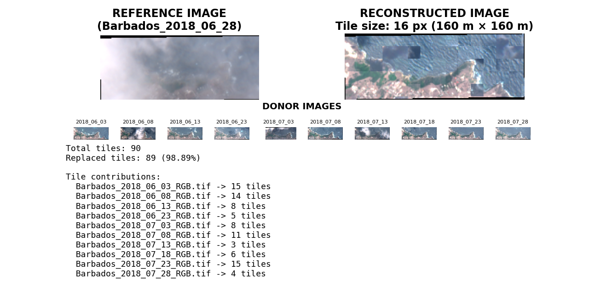
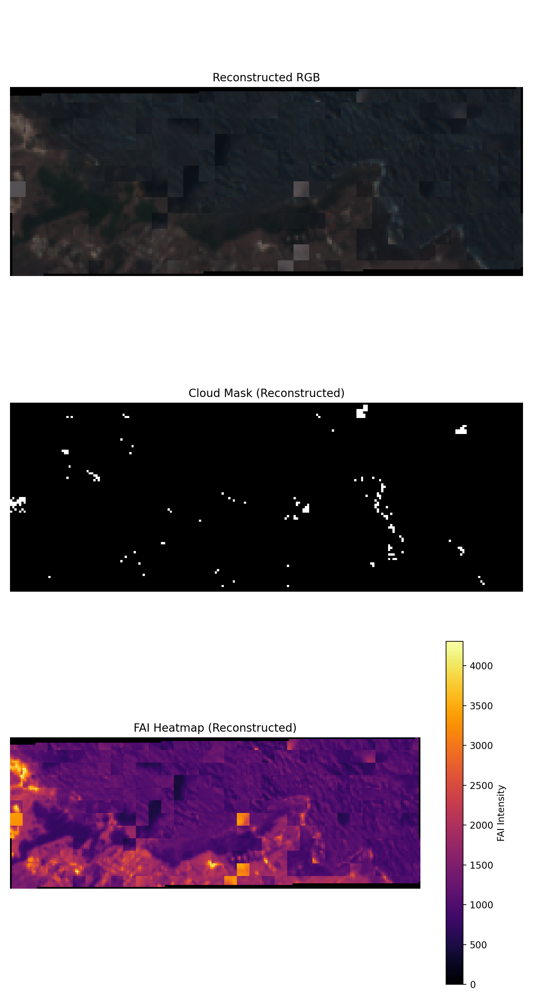

# Puzzle-Based Reconstruction of Cloud-Obscured Sargassum Fields

**Author:** Nasean Belgrave  
**Programme:** BSc Computer Science (Double)  
**Course:** COMP3490 – Research Project  
**Institution:** University of the West Indies, Cave Hill  
**Date:** November 2025

## Overview

Persistent cloud cover significantly limits the use of optical satellite imagery for monitoring Sargassum influxes in the Caribbean. This project presents a tile-based, puzzle-inspired image reconstruction framework that restores cloud-obscured Sentinel-2 imagery to produce more continuous offshore Sargassum distribution maps for the east coast of Barbados.

The approach adapts ideas from greedy jigsaw puzzle solvers to a remote-sensing context, selectively replacing cloud-contaminated image tiles using clearer observations from neighbouring acquisition dates. To preserve biologically meaningful features, Floating Algae Index (FAI) information is incorporated during donor tile selection.

This repository provides a public, data-safe implementation of the core algorithms and visualisation tools developed during the research.

## Why This Matters
### Environmental relevance
Sargassum influxes affect tourism, fisheries, and coastal ecosystems across the Caribbean. Reliable monitoring is often hindered by persistent cloud cover in satellite imagery.

### Technical relevance
The project demonstrates how algorithmic problem-solving techniques (tiling, greedy optimisation, similarity constraints) can be repurposed for real-world computer vision and geospatial analysis problems.

## Key Technical Contributions

- Designed a modular, tile-based reconstruction pipeline in Python
- Implemented RGB-only cloud and haze detection, avoiding reliance on QA60 masks
- Developed a greedy donor-tile selection strategy inspired by jigsaw puzzle solvers
- Integrated FAI-guided prioritisation to preserve Sargassum structures
- Evaluated reconstruction quality using Tile Replacement Rate (TRR) and Residual Cloud Coverage (RCC)
- Produced clear visual validation outputs (RGB, cloud masks, FAI heatmaps)

## Method Overview
### Data Preparation
Multi-date Sentinel-2 imagery (RGB reflectance and pre-computed FAI layers) is segmented into fixed-size tiles, with support for partial edge tiles.

### Cloud Detection
Clouds and atmospheric haze are identified using RGB-based heuristics:

- Pixel brightness
- Colour neutrality (low saturation)
- Blue-channel dominance

### Puzzle-Based Reconstruction
- For each cloudy tile in a reference image:
- Candidate donor tiles are drawn from other acquisition dates
- Donors must exhibit lower cloud contamination
- Spectral consistency constraints reduce visual artefacts
- FAI values are used to prioritise Sargassum-rich tiles

### Validation
Reconstruction quality is assessed using:
- Tile Replacement Rate (TRR)
- Residual Cloud Coverage (RCC)
- Visual comparison of reconstructed RGB imagery, cloud masks, and FAI heatmaps

## Results Highlights
- Achieved ~98.9% tile replacement on heavily cloud-obscured reference scenes
- Significant reduction in residual cloud coverage post-reconstruction
- FAI heatmaps confirm preservation of offshore Sargassum features
- Visual outputs demonstrate improved spatial continuity of reconstructed imagery

### Example Outputs
<p align="center">  </p> <p align="center">  </p>

Additional figures (cloud coverage statistics, tile grids, cloud masks) are available in the figures/ directory.

## Repository Structure
```
src/
  multi_image_reconstruct_public.py
  cloud_mask_visualizer.py
  tile_grid_visualizer.py
  fai_heatmap_visualizer.py
  cloud_coverage_plot.py
  validation.py

figures/
  fig1_cloud_coverage_per_scene.png
  fig2_cloud_coverage_distribution.png
  fig3_cloud_mask_example.png
  fig4_tile_grid_overlay.png
  fig5_reconstruction_overview.png
  fig6_validation_stack.png

requirements.txt
README.md
```

## Dependencies
Minimal dependencies are used to keep the project lightweight and portable:

- numpy
- matplotlib
- rasterio
- pillow

## Data & Reproducibility
Raw and processed Sentinel-2 imagery are not included due to data size and licensing constraints.
This repository intentionally provides a demonstration-grade, non-turnkey implementation suitable for academic review and technical evaluation.

Researchers or collaborators interested in full reproducibility may contact the author.

## Skills Demonstrated
- Python (NumPy, Rasterio, Matplotlib)
- Computer Vision & Image Processing
- Remote Sensing & Geospatial Analysis
- Algorithm Design (greedy optimisation, tiling strategies)
- Research-driven software development
- Scientific visualisation and evaluation

## Future Directions
- Introduce seam-aware tile blending and multi-scale tiling to reduce boundary artefacts
- Extend the framework to regional and basin-scale Sargassum monitoring
- Integrate ocean current and wind data for drift prediction and early-warning systems
- Incorporate alternative colour spaces (e.g., HSV, CIELAB, YCbCr) to improve cloud and haze discrimination beyond RGB heuristics
- Explore multi-spectral and index-based feature fusion (RGB, FAI, NDVI, texture descriptors)
- Adapt the methodology to other environmental monitoring tasks such as turbidity mapping, coastal erosion assessment, and flood detection
